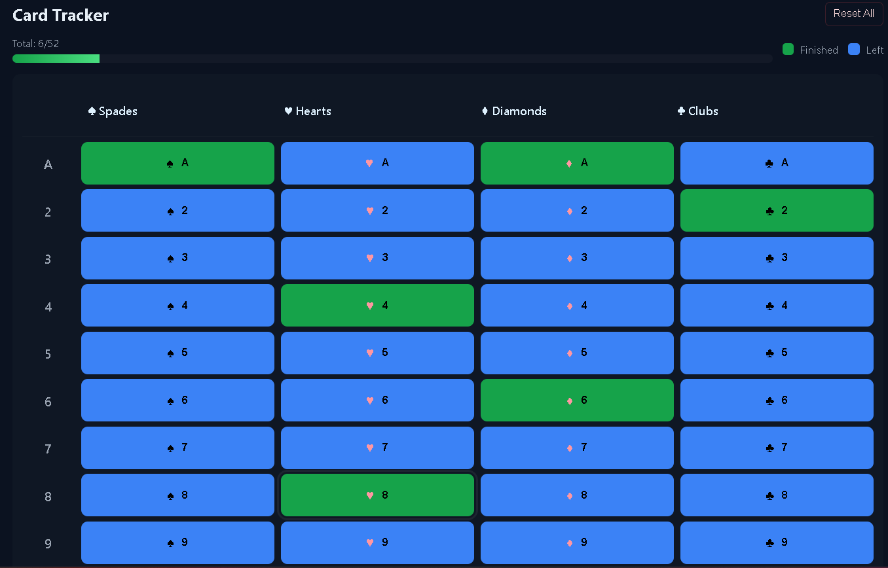

# ♣️♦️ **Card Tracker** — React + Vite Web App
A minimal, fast, and beautifully designed card-tracking web application built using **React**, **Vite**, and **pure CSS**. The app helps you visually track which cards have been **used (Finished)** and which are **remaining (Left)** using a clean **13 × 4 grid** layout.

Designed for card games, probability tracking, bridge practice, and memory training.

---

## 🎯 **Features**

### ✔️ **Perfect Grid Layout (13 × 4)**
- **13 rows** representing card ranks: A, 2–10, J, Q, K
- **4 columns** representing suits: ♠ Spades, ♥ Hearts, ♦ Diamonds, ♣ Clubs

### ✔️ **Color-coded Cards**
- **Blue = Left (unused)**
- **Green = Finished (used)**
- Clean, modern dark-theme interface for eye comfort

### ✔️ **LocalStorage Persistence**
- Your progress automatically saves in the browser
- Refresh the page anytime — your card states remain intact

### ✔️ **Keyboard Accessible**
- Use **Enter** or **Space** to toggle a selected card
- Focus rings added for accessibility

### ✔️ **Suit-level Controls**
- **Mark All** cards in a suit
- **Clear** a full suit
- **Reset All** button for full wipe

### ✔️ **Beautiful Dark Mode UI**
- Custom CSS (no frameworks)
- Pleasant colors and smooth interactions

---

## 🖥️ **Tech Stack**

| Component | Technology |
|----------|------------|
| UI | React (JSX) |
| Build tool | Vite |
| Styling | Pure CSS (dark theme) |
| Deployment | GitHub Pages |

---

## 🚀 **Installation & Running Locally**

### **1️⃣ Clone the repository**
```bash
git clone https://github.com/yourusername/card-tracker.git
cd card-tracker
```

### **2️⃣ Install dependencies**
```bash
npm install
```

### **3️⃣ Run development server**
```bash
npm run dev
```
The app will be available at:
```
http://localhost:5173
```

### **4️⃣ Build for production**
```bash
npm run build
```

---

## 🌐 **Deploying to GitHub Pages**

### — **Automatic Deploy**
Add this GitHub Actions workflow to `.github/workflows/deploy.yml`:
```yml
name: Deploy Card Tracker
on:
  push:
    branches: [ main ]

jobs:
  deploy:
    runs-on: ubuntu-latest
    steps:
      - uses: actions/checkout@v3
      - uses: actions/setup-node@v4
        with:
          node-version: 22
      - run: npm install
      - run: npm run build
      - uses: peaceiris/actions-gh-pages@v3
        with:
          github_token: ${{ secrets.GITHUB_TOKEN }}
          publish_dir: ./dist
```
This automatically builds & deploys your website to **https://Gurnaj1Singh.github.io/card-tracker/** on every push.


---

## 🎨 **Screenshots**


---

---

## ❤️ **Contributions**
Pull requests are welcome! Feel free to improve the UI, enhance accessibility, or optimize performance.

---

### ⭐ If you like this project, consider giving the repository a star on GitHub!
